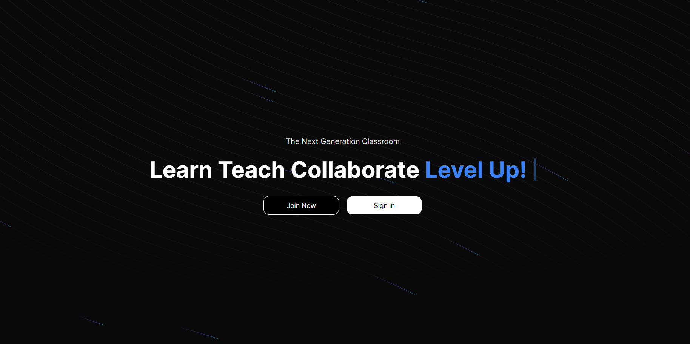
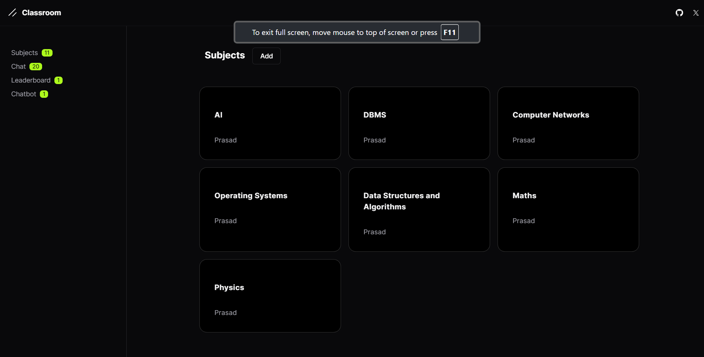

# Classroom of Elite

**Classroom of Elite** is a modern classroom app designed to enhance the experience of students. The app provides better UI and easy access to resources, implements a smart XP system to foster a competitive environment, and includes a chatbot to solve student doubts.

### Tech Stack

- **Frontend**: React, Tailwind CSS, Next.js
- **Backend**: Next.js, NextAuth
- **Others**: OpenAI API

### Features

- **Better UI and Easy Access**: Designed with a modern and intuitive interface to enhance the student experience.
- **Smart XP System**: Implements a competitive XP system to motivate students based on their activity.
- **Chatbot**: Utilizes OpenAI API to provide a chatbot for solving student doubts.
- **Class Resources**: Easy access to all class-related resources.

### Links

- [Live Demo](#)
